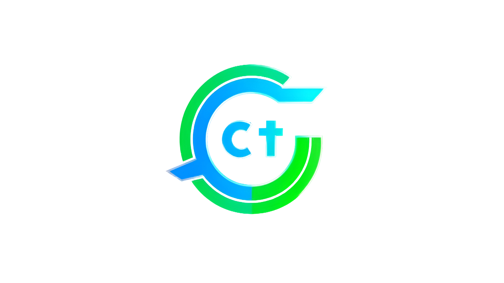

<div align="center">
  
  <h1>🚀 Capital Management System</h1>
  <p>A professional enterprise-grade frontend for managing business missions, activity reports (CRA), and automated invoicing.</p>

  <!-- Badges -->
  
  
  
  
</div>

---

## 📖 Table of Contents
- [About](#about)
- [Features](#features)
- [Tech Stack](#tech-stack)
- [Installation](#installation)
- [Usage](#usage)
- [Project Structure](#project-structure)
- [License](#license)
- [Authors](#authors)

---

## 🎯 About
**Capital Management System** is a robust web application built to streamline the operations of service-oriented companies. It provides a centralized platform for tracking employee missions, managing client and supplier relations, and automating the generation of critical business documents like contracts and invoices. The project focuses on security, scalability, and an intuitive user experience for all administrative and field roles.

---

## ✨ Features
- ⚡ **Multi-Role Dashboard** — Tailored interfaces for Admins, HR, Managers, and Service Providers.
- 🔒 **Secure Auth System** — Role-based access control with JWT integration for protected data management.
- 📝 **CRA Reporting** — Dynamic monthly activity report (CRA) submission and validation workflow.
- 📄 **PDF Automation** — Professional generation of invoices and contracts directly from the browser.
- 🤝 **Partner Management** — Advanced CRUD systems for clients and suppliers with detailed profile tracking.
- 🎯 **AI Matching** — Advanced profile matching and filtering powered by Ollama AI.
- 📁 **Document Hub** — Secure storage and management of KBIS and digital signatures.
- 💹 **Mission Tracking** — Real-time assignment and mission status monitoring for all prestataires.

---

## 🛠️ Tech Stack
| Technology | Purpose |
|------------|---------|
| **Angular 19** | Modern UI Framework |
| **TypeScript** | Primary Programming Language |
| **Bootstrap 5** | Responsive Design & Layout |
| **RxJS** | Reactive Data Stream Management |
| **jsPDF** | Client-side Document Generation |
| **html2canvas** | HTML-to-Image Conversion for PDFs |

---

## 📦 Installation
Follow these steps to set up the project on your local machine:

1. **Clone the repository:**
   ```bash
   git clone https://github.com/KhairatMouhcine/FrontEnd-Capital-Angular.git
   ```

2. **Install dependencies:**
   ```bash
   npm install
   ```

3. **Run the development server:**
   ```bash
   npm start
   ```
   Navigate to `http://localhost:4200/` in your browser.

---

## 🚀 Usage
### Workflow Overview:
1. **Login**: Enter your credentials to access your role-specific dashboard.
2. **Management**: Admins can manage users and roles, while HR/Managers manage clients and contracts.
3. **CRA Submission**: Service providers fill out their daily activities and submit for approval.
4. **Invoicing**: Once a CRA is validated, managers can generate and download the final invoice as a PDF.

---

## 📁 Project Structure
```text
src/
├── app/
│   ├── components/    # Reusable UI components (login, forms, list components)
│   ├── pages/         # Main feature modules (admin, rh, manager, prestataire)
│   ├── services/      # Core business logic and API integration
│   ├── guards/        # Authentication and authorization guards
│   ├── Layout/        # Shared application shell and navigation
│   ├── remplir-cra/   # Module dedicated to CRA activity reporting
│   └── app.routes.ts  # Application-wide routing definitions
├── assets/            # Static files (images, icons, global styles)
└── environments/      # Environment-specific configuration
```

---

## 📄 License
This project is licensed under the MIT License.

---

## 👨‍💻 Authors

<div align="center">
  <table>
    <tr>
      <td align="center">
        
        <br />
        <b>KhairatMouhcine</b>
        <br />
        <a href="https://github.com/KhairatMouhcine">
          
        </a>
        <a href="mailto:khairatmouhcine125@gmail.com">
          
        </a>
      </td>
      <td align="center">
        
        <br />
        <b>ELFAIZE Youssef</b>
        <br />
        <a href="https://github.com/ELFAIZE-Youssef">
          
        </a>
        <a href="mailto:youssefmae26082000@gmail.com">
          
        </a>
      </td>
      <td align="center">
        
        <br />
        <b>Bassma</b>
        <br />
        <a href="https://github.com/Bassma02">
          
        </a>
        <a href="mailto:b.chihab2002@gmail.com">
          
        </a>
      </td>
    </tr>
  </table>
</div>
